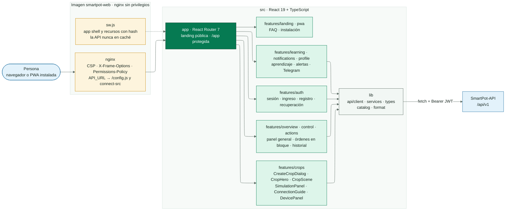
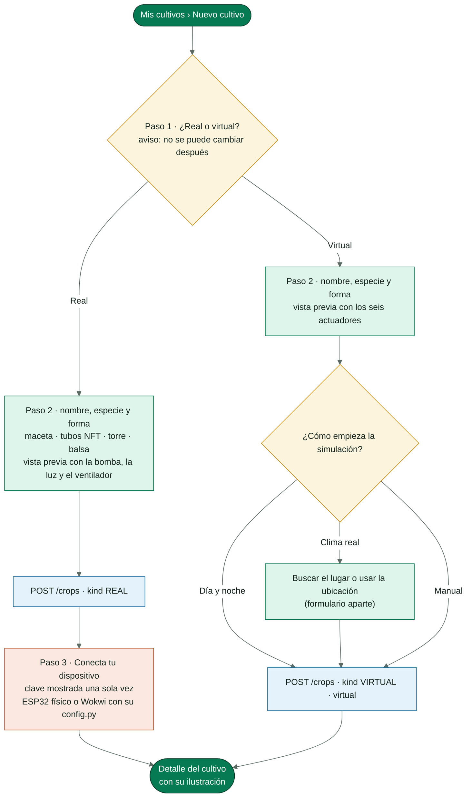
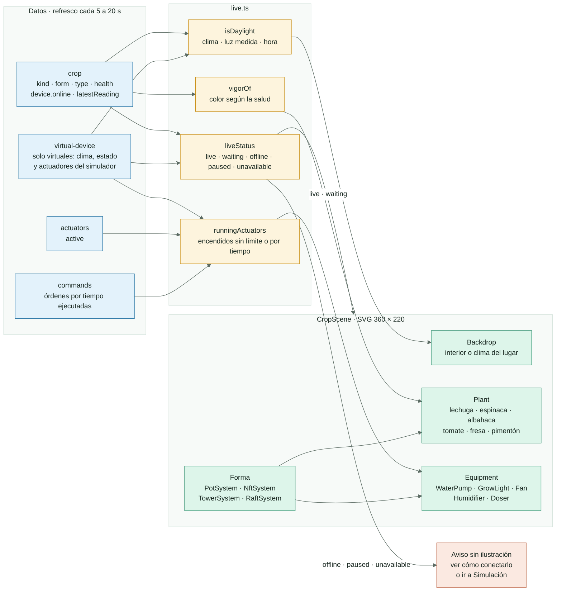
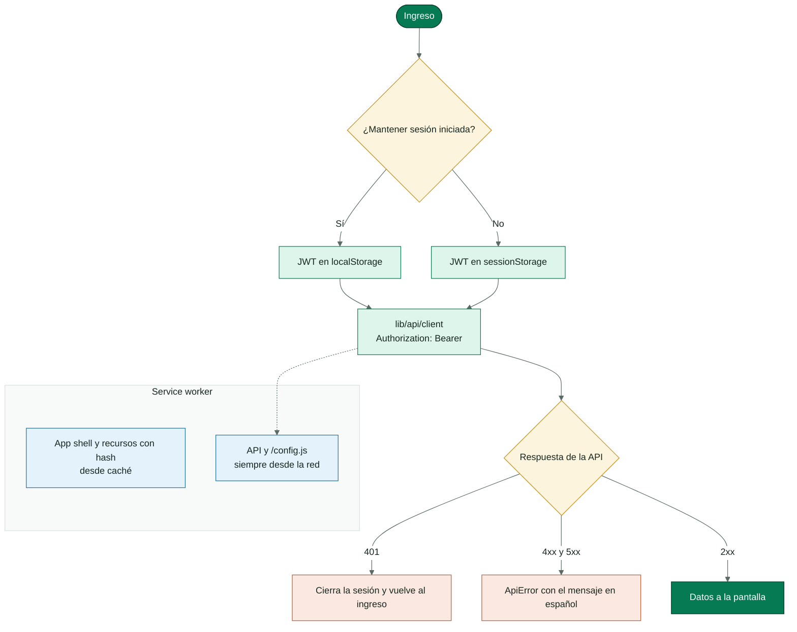

<!-- portada
eyebrow: Documentación del componente
titulo: SmartPot-Web
acento: Web
subtitulo: La aplicación de SmartPot
bajada: PWA instalable: panel general, creación de cultivos reales o virtuales, ilustración de cada cultivo con su especie y sus actuadores, asistente de IA, control, aprendizaje, alertas y Telegram, con su seguridad, configuración y pruebas.
documento: SmartPot-Web
version: 1.0 · septiembre 2026
equipo: SmartPotTech
proyecto: smartpot.app
-->

# SmartPot-Web

## Ficha del documento

| Campo | Valor |
| --- | --- |
| Proyecto | SmartPot · [smartpot.app](https://smartpot.app) |
| Componente | [SmartPot-Web](https://github.com/SmartPotTech/SmartPot-Web) |
| Versión | 1.0 · septiembre 2026 |
| Alcance | Pantallas, creación de cultivos, ilustración del cultivo, sesión, caché, identidad visual, seguridad web, configuración y pruebas |
| Documentación de la plataforma | [Documentación técnica](https://github.com/SmartPotTech/.github/blob/main/docs/SmartPot_Technical_Documentation.md), [recorrido del proyecto](https://github.com/SmartPotTech/.github/blob/main/docs/SmartPot_Project_Journey.md), [ciclo de vida](https://github.com/SmartPotTech/.github/blob/main/docs/SmartPot_Software_Lifecycle.md) y [diagramas generales](https://github.com/SmartPotTech/.github/blob/main/docs/README.md#diagramas-generales) |
| Mantenimiento | Se genera desde `docs/` de este repositorio con las herramientas de `.github/docs/tools`; se actualiza con cada cambio del componente |

<!-- parte: PARTE I | El componente -->

## 1. Propósito

### En palabras simples

SmartPot-Web es lo que ve la persona: una página pública que explica SmartPot y, tras ingresar, una aplicación que se instala en el teléfono o el computador. Muestra cada cultivo en vivo, lo compara con el rango ideal de su especie, deja crear cultivos reales o virtuales, dar órdenes a los actuadores y ver qué piensa y qué aprende el asistente. Todo lo que muestra viene de la API.

| Pantalla | Qué permite |
| --- | --- |
| Inicio público | Presentación, funciones, especies y preguntas frecuentes; indexable |
| Panel general | Salud de cada cultivo, comparación de una variable, últimas lecturas y análisis de la IA de toda la cuenta |
| Mis cultivos | Tarjetas con tipo, especie, forma, estado y salud; asistente de creación |
| Detalle | La ilustración del cultivo sobre todas las secciones: resumen, asistente IA, control, historial, dispositivo (reales) o simulación (virtuales) y ajustes |
| Control general y acciones | Modo automático y órdenes en bloque; sugerencias e historial de órdenes |
| Aprendizaje, alertas y perfil | Lo que aprende la IA, notificaciones, Telegram, datos y contraseña |

## 2. Arquitectura del componente

<!-- diagrama: SmartPot_Web_Global_Component | titulo=SmartPot-Web por dentro | lamina=H -->

Cada función vive en `src/features/<función>` con sus páginas, componentes y pruebas. `lib/api` es el único lugar que habla con la API: arma las peticiones con el token, traduce los errores a `ApiError` en español y declara los tipos de cada respuesta. `useResource` carga y refresca los datos mientras la pestaña está visible.

<!-- parte: PARTE II | Cultivos -->

## 3. Crear un cultivo

<!-- diagrama: SmartPot_Web_01_Crop_Creation_Flow | titulo=Asistente para crear un cultivo -->

| Decisión | Detalle |
| --- | --- |
| Tipo | Real (un ESP32 con el firmware, físico o en Wokwi) o virtual (lo simula SmartPot). No cambia después; Ajustes lo muestra y explica cómo crear otro |
| Forma | Maceta, tubos NFT, torre vertical o balsa flotante; se puede cambiar en Ajustes y solo afecta la ilustración |
| Vista previa | La escena del cultivo con la especie y la forma elegidas y los actuadores con los que nace |
| Real | Muestra la clave una sola vez y la guía: circuito y pines, firmware y `config.py` con la red WiFi, o el proyecto de Wokwi con la red `Wokwi-GUEST` |
| Virtual | Día y noche, clima real (buscador de lugares o ubicación del dispositivo) o manual; abre el cultivo y su configuración queda en la pestaña Simulación |

## 4. Ilustración del cultivo

<!-- diagrama: SmartPot_Web_02_Live_Scene | titulo=Cómo se dibuja la ilustración del cultivo | lamina=H -->

| Pieza | Qué dibuja |
| --- | --- |
| Maceta | Depósito con la bomba, tubo que gotea sobre el sustrato y dosificadores sobre la tapa |
| Tubos NFT | Tres tubos con cuatro plantas cada uno, colector de entrada y retorno al depósito; la película de solución corre si la bomba está encendida |
| Torre vertical | Columna con bolsillos escalonados; la bomba sube la solución y cae en gotas por dentro |
| Balsa flotante | Estanque con la balsa, raíces en la solución y burbujas desde la piedra difusora |
| Luz de cultivo | Barra con LED; encendida ilumina las plantas |
| Ventilador y humidificador | Aspas que giran con corriente de aire; bruma que sube |
| Plantas | La especie tal como es: lechuga en roseta, espinaca de hoja ancha, albahaca de hojas pareadas, tomate con tutor, flores y frutos rojos, fresa con flor blanca y frutos, pimentón rojo y amarillo; las hojas con el color de su salud: verde sano, amarillento en riesgo, ocre crítico |

La escena usa la paleta de SmartPot, anuncia su contenido con `aria-label` (qué se ve y qué está encendido) y sus animaciones se detienen si la persona prefiere menos movimiento. Va encima de todas las secciones del detalle (`CropHero`). Junto a ella, cada actuador aparece como una etiqueta con su estado; no hay botones: las órdenes se dan en Control. Si el cultivo no está conectado no se ilustra: se explica cómo conectarlo (reales) o se lleva a la pestaña Simulación para reanudarla (virtuales). La configuración de la simulación (modo, lugar, medidores, frecuencia y pausa) vive en esa pestaña, que solo aparece en los cultivos virtuales.

<!-- parte: PARTE III | Operación -->

## 5. Sesión, caché y seguridad

<!-- diagrama: SmartPot_Web_03_Session_And_Cache | titulo=Sesión y caché de la PWA -->

| Control | Detalle |
| --- | --- |
| CSP | `script-src 'self'`, `style-src 'self'`, `connect-src` limitado a la API |
| Cabeceras | `X-Frame-Options: DENY`, `nosniff`, `Referrer-Policy` y `Permissions-Policy` (geolocalización solo del propio sitio y solo cuando la persona la pide) |
| Sesión | JWT en `sessionStorage`, o en `localStorage` con «Mantener sesión iniciada»; un 401 la cierra |
| Clave del dispositivo | Solo se muestra al crear un cultivo real o al rotarla |
| SEO | Metadatos, Open Graph, JSON-LD (`Organization`, `WebSite`, `SoftwareApplication`, `FAQPage`), `robots.txt` y `sitemap.xml`; `/app` no se indexa |

## 6. Configuración

| Variable | Dónde | Uso |
| --- | --- | --- |
| `VITE_API_URL` | `.env` en desarrollo | URL de la API para `pnpm dev` |
| `API_URL` | Contenedor | Se escribe al arrancar en `/config.js` y en la CSP: la misma imagen sirve para cualquier entorno |

Identidad visual: tokens de la paleta SmartPot en `src/styles/index.css`, tipografías Outfit e Inter servidas desde la app y una paleta categórica de 8 colores validada para daltonismo en las comparativas.

## 7. Pruebas

`pnpm lint`, `pnpm typecheck`, `pnpm test` y `pnpm build`. Las 54 pruebas de Vitest y Testing Library cubren el cliente HTTP y sus errores, la sesión, las validaciones, el ingreso, los componentes del cultivo, el asistente con pronóstico y lo aprendido, la comparación de modelos, Telegram, el panel general, la ilustración del cultivo (formas, especies, actuadores, clima y conexión), la creación real o virtual, la guía de conexión y los requisitos de SEO y PWA.

## 8. Operación

| Tarea | Cómo |
| --- | --- |
| Imagen | `ghcr.io/smartpottech/smartpot-web`: nginx sin privilegios, solo lectura con `tmpfs` |
| Despliegue | Cada cambio en `main` pasa por el CI, publica la imagen y pide el despliegue central de `.github` |
| Íconos | `pnpm icons` regenera los PNG de la PWA desde los SVG |
| Caché del navegador | Una versión nueva del service worker reemplaza el app shell al recargar |
